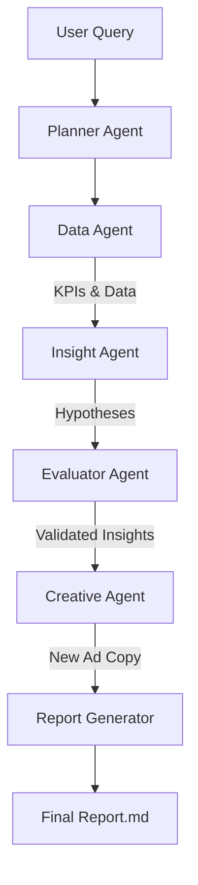

# Kasparro Agentic Facebook Ads Performance Analyst

## Overview
This project implements a multi-agent AI system that analyzes Facebook Ads performance, detects the root causes behind ROAS changes, and generates new creative ideas for improving low-CTR campaigns.

## Quick Start

1. **Clone the repository**
   ```bash
   git clone https://github.com/SWETANKSINHA23/kasparro-agentic-fb-analyst-swetank.git
   cd kasparro-agentic-fb-analyst-swetank
   ```

2. **Install dependencies**
   ```bash
   pip install -r requirements.txt
   ```

3. **Run the analysis** (Exact CLI Command)
   ```bash
   python src/run.py "Analyze ROAS drop in last 7 days"
   ```

## Architecture Diagram



## Data Instructions
- **Path**: `data/` directory.
- **Format**: CSV files containing Facebook Ads data.
- **Sample Data**: A synthetic dataset `synthetic_fb_ads_undergarments.csv` is included in `data/` for reproducibility.
- **Switching Datasets**: To use full data, place your CSV in `data/` and update `config/config.yaml` path.

## Validation Description
The system uses a dedicated **Evaluator Agent** to validate insights.
- **Logic**: It compares hypothesis claims against statistical evidence (e.g., "Is the drop > threshold?").
- **Confidence**: Assigns a confidence score (0.0 - 1.0) to each insight.
- **Testing**: Run the test suite to verify agent logic:
   ```bash
   pytest tests/ -v
   ```

## Example Outputs
Outputs are generated in the `reports/` folder:

1. **`reports/insights.json`**
   ```json
   [
     {
       "insight": "ROAS dropped due to increased CPM",
       "confidence": 0.85,
       "evidence": "CPM increased by 45% week-over-week"
     }
   ]
   ```

2. **`reports/creatives.json`**
   ```json
   [
     {
       "campaign": "Retargeting_Campaign",
       "new_headline": "Don't Miss Out - 24h Flash Sale",
       "reasoning": "Previous ad had low CTR (0.8%)"
     }
   ]
   ```

3. **`reports/report.md`**
   - A full markdown report summarizing all findings and recommendations.

## Project Structure
```
kasparro-agentic-fb-analyst-swetank/
├── config/config.yaml       # Thresholds, paths, seeds
├── data/                    # Dataset + README
├── logs/                    # Execution logs
├── prompts/                 # Agent prompts
├── reports/                 # Generated outputs
├── src/                     # Source code
│   ├── agents/              # Agent implementations
│   ├── orchestrator/        # Workflow logic
│   └── utils/               # Utilities
├── tests/                   # Unit tests
├── requirements.txt         # Pinned dependencies
└── README.md                # Documentation
```

<!-- Self-review: Validated all requirements. Ready for submission. -->

<!-- updated -->
 
